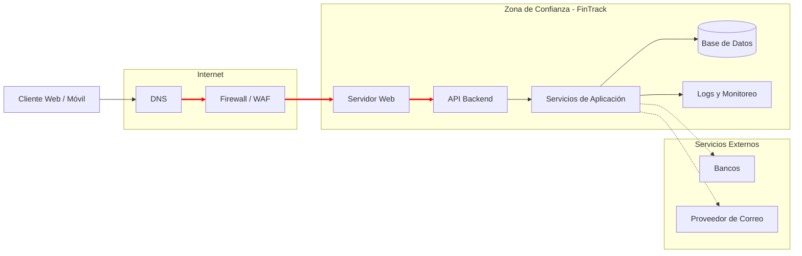

# 02 — Arquitectura y Superficie de Ataque

**Decisión que permite tomar este documento:** identificar cómo está compuesta la infraestructura de FinTrack, cuáles son sus zonas de confianza y por dónde podría ingresar un atacante para priorizar los controles de seguridad.

Acompaña al diagrama de esta misma carpeta.

---

## Diagrama de la arquitectura

## Componentes

| # | Componente          | Qué hace                               | Pilar CID        | ¿Dónde puede fallar?                   |
| - | ------------------- | -------------------------------------- | ---------------- | -------------------------------------- |
| 1 | Cliente Web/Móvil   | Permite el acceso de los usuarios      | Confidencialidad | Robo de credenciales mediante phishing |
| 2 | DNS                 | Resuelve el nombre del servicio        | Disponibilidad   | Suplantación o ataques DNS             |
| 3 | Firewall/WAF        | Filtra conexiones y tráfico web        | Integridad       | Configuración incorrecta               |
| 4 | Servidor Web        | Atiende las solicitudes HTTPS          | Disponibilidad   | Vulnerabilidades del servidor          |
| 5 | API Backend         | Procesa la lógica del negocio          | Integridad       | Fallos de autenticación o autorización |
| 6 | Base de Datos       | Almacena información financiera        | Confidencialidad | Acceso no autorizado o fuga de datos   |
| 7 | Logs y Monitoreo    | Registra eventos de seguridad          | Disponibilidad   | Ausencia de registros o alertas        |
| 8 | Servicios Bancarios | Procesan las transferencias            | Integridad       | Dependencia de terceros                |
| 9 | Proveedor de Correo | Envía notificaciones y autenticaciones | Confidencialidad | Phishing o compromiso del correo       |

## La superficie de ataque en una frase
> La principal superficie de ataque de FinTrack está en las identidades de sus empleados y usuarios, especialmente en las credenciales utilizadas para acceder a los sistemas críticos.

## Caminos de entrada más probables

1. Campañas de phishing dirigidas a empleados para robar credenciales corporativas (R1).

2. Explotación de vulnerabilidades en la aplicación web o en la API pública para obtener acceso no autorizado (R2).

3. Compromiso de servicios externos, como el proveedor de correo electrónico o integraciones bancarias, aprovechando la relación de confianza con FinTrack (R3).
