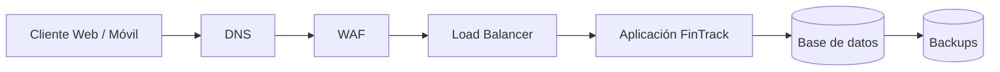

# Diagrama de red de FinTrack

```mermaid
flowchart LR
    U[Cliente Web / Móvil]
    D[DNS]
    W[WAF]
    LB[Load Balancer]
    A[Aplicación FinTrack]
    DB[(Base de datos)]
    B[(Backups)]

    U --> D
    D --> W
    W --> LB
    LB --> A
    A --> DB
    DB --> B
```
