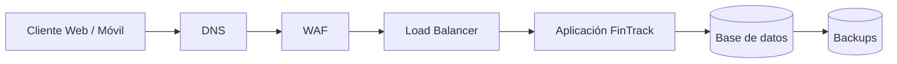

# Convenciones de diagramas

Cómo dibujar los diagramas de este repositorio.

## Formato
Los diagramas se escriben en Mermaid, dentro del .md que los explica.
No se usan imágenes sueltas (.png) sin fuente editable: cuando cambie el
análisis, un .png queda obsoleto y nadie puede corregirlo ni ver el cambio
en el historial.

## Reglas visuales
- Agrupa los componentes en zonas de confianza (subgraph).
- Los terceros van FUERA de las zonas, con línea punteada: son confianza
  heredada, no infraestructura propia.
- Marca en rojo los caminos de entrada. Sin esa capa, es un diagrama de
  red, no de seguridad.
- Usa `fill:transparent` en los subgraph para que se lea en tema oscuro.

## Antes de subir un diagrama
1. ¿Responde a una sola pregunta?
2. ¿Está el texto que lo explica junto a él?
3. ¿Se lee en tema oscuro?
4. ¿Marca por dónde entra un atacante?

# Diagrama de red de FinTrack

